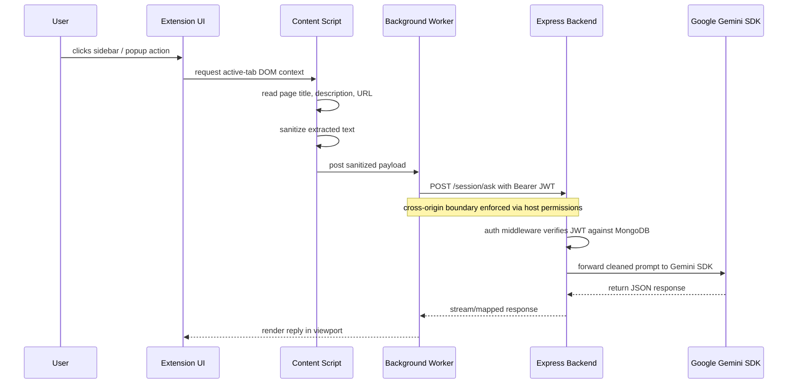

# StudyBuddy AI (Chrome Extension + Containerized Backend)
A context-aware browser extension and decoupled API server engineered to parse active-tab DOM structures and deliver secure, low-latency AI interactions.

## 🔄 System Architecture


## 📊 Key Features
| Pillar | What it does |
|---|---|
| Context Extraction | Manifest V3 content scripts read active-tab DOM strings and normalize page text before sending it to the backend. |
| Cross-Origin Authentication | Stateless JWT tokens guard backend routes, while bcrypt-hashed user credentials are persisted in MongoDB. |
| Test Lifecycle Automation | Intended endpoint validation via Jest and Supertest for auth and analysis routes, with a target >85% coverage across critical boundaries. |
| Security Hardening | Global error handling removes raw stack traces from JSON responses in production builds. |

## � Directory Structure
```
StudyBuddy AI/
├─ docker-compose.yml
├─ .env.example
├─ backend/
│  ├─ Dockerfile
│  ├─ package.json
│  ├─ package-lock.json
│  ├─ tsconfig.json
│  ├─ src/
│  │  ├─ index.ts
│  │  ├─ config/
│  │  │  └─ db.ts
│  │  ├─ middleware/
│  │  │  └─ auth.ts
│  │  ├─ models/
│  │  │  ├─ Session.ts
│  │  │  └─ User.ts
│  │  ├─ routes/
│  │  │  ├─ auth.ts
│  │  │  ├─ session.ts
│  │  │  └─ user.ts
│  │  ├─ services/
│  │  │  ├─ gemini.ts
│  │  │  ├─ hints.ts
│  │  │  └─ prompt.ts
│  └─ ...
├─ studybuddy-extension/
│  ├─ manifest.json
│  ├─ background.js
│  ├─ contentScript.js
│  ├─ popup.html
│  ├─ popup.js
│  ├─ sidebar.html
│  ├─ sidebar.js
│  ├─ styles.css
│  └─ icons/
```

## 🚀 Local Installation & Execution
1. From the root repository directory:
   - `docker compose up -d`
   - This starts MongoDB and the backend container.
2. Verify backend readiness:
   - `curl http://localhost:4000/`
   - Current backend code exposes a root route at `/`; use `/api/health` only if you add that endpoint.
3. Backend environment:
   - create `backend/.env`
   - populate it with the keys from `backend/.env.example`
4. Load the Chrome extension:
   - open `chrome://extensions/`
   - enable Developer mode
   - click `Load unpacked`
   - select the `studybuddy-extension/` folder

## 🧪 Testing Boundary
- Run the backend test suite from inside `backend/`:
  - `npm run test`
- If tests are not yet implemented, add Jest and Supertest coverage for `auth` and `session` routes first.
